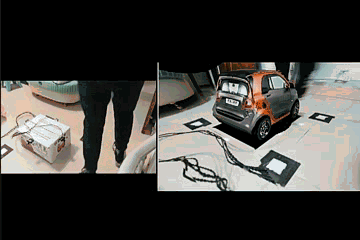
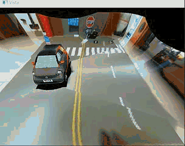
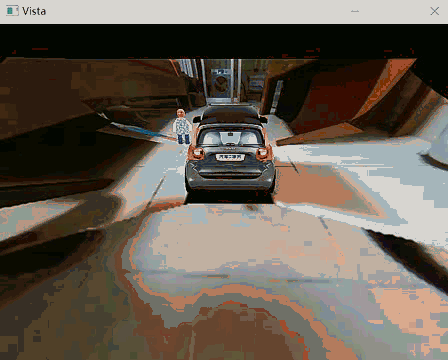

# C++ 版本 —— 汽车三维环视系统

## 1. 项目概况

此版本是上一个[基础版](https://github.com/AriaTZY/Vehicle-Panoramic-View-Python)的升级，主要在于将OpenCV的实现移植到了C++版本上，大大提高了运算速度，使其可以实时运行。同时使用了OpenGL编程，利用贴图技术，把画面按规律投影在提前预制好的“碗”上，从而实现3D环视的效果。

最后，本项目还会展示使用增强显示技术来解决的车辆畸变问题。

## 2. 3D环视

3D环视主要是借助于OpenGL的贴图技术实现的，首先建立一个碗状模型，之后通过相机外参与内参分别计算出碗状模型上的key vertices所对应的图片位置，构建出查找表（LUT：Look Up Table）。实时计算时将四路鱼眼相机所拍摄画面贴图在模型上，即可得到3D全景环视系统。

下图显示了系统工作情况，首先已经可以在GPU很一般的电脑上（我使用的PC进行运算，GPU为MX940）做到实时处理。左半边是实际情况：我在拉动模型车移动；有半边是合成画面，可见接缝部分已经处理地很好，且显示流畅，同时对比起2D俯视全景图，3D全景图能够给司机提供更直观的观察以及对周围三维物体更小的畸变。

## 3. 增强全景

3D全景存在的问题是，当立体物体离车身很近时，提前预制的“碗状”模型便不能够胜任正确的投影关系了，因而同2D俯视全景一样，也会对立体物体产生严重的畸变，如下图所示。

所以结合YOLO物体检测，先在原视频中检出车辆，再通过相机外参和内参推断检出车辆处于世界坐标系下的位置（核心步骤），最后再将提前建立好的车辆模型放置在估算位置上，用来替代畸变的车辆。通过以下动图可以看出对于位置估计的准确率还是较高的。

